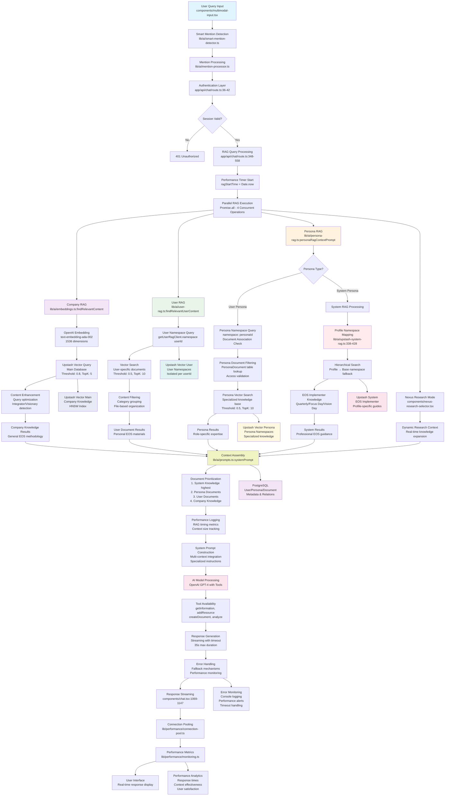
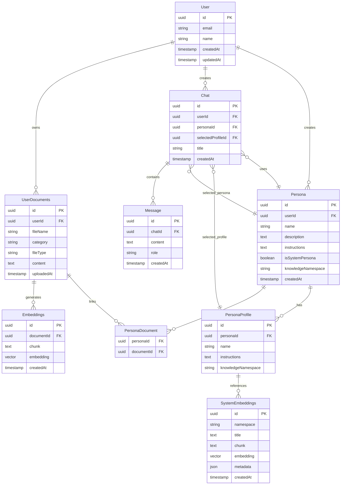
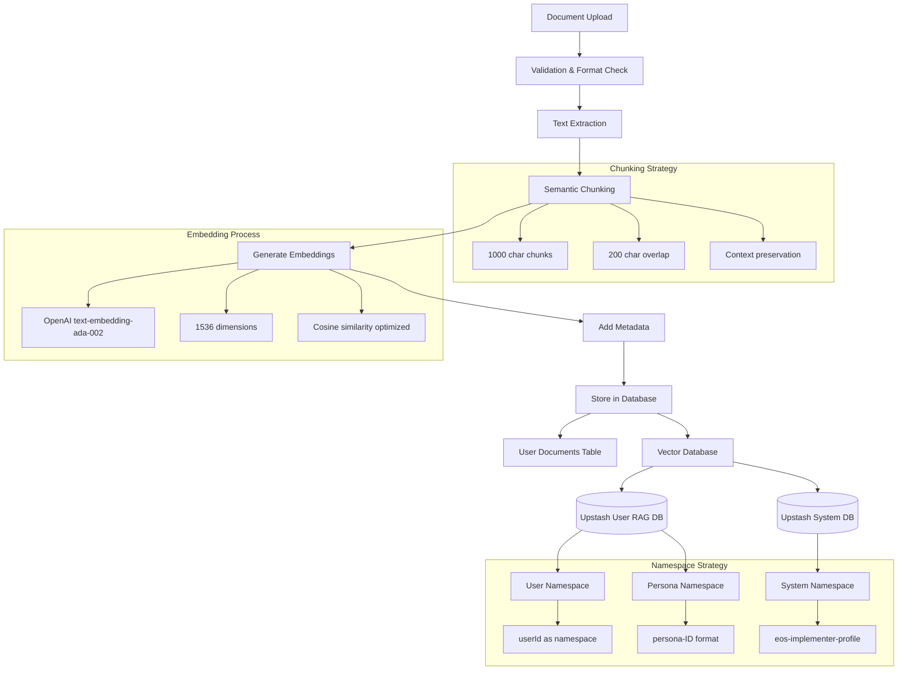
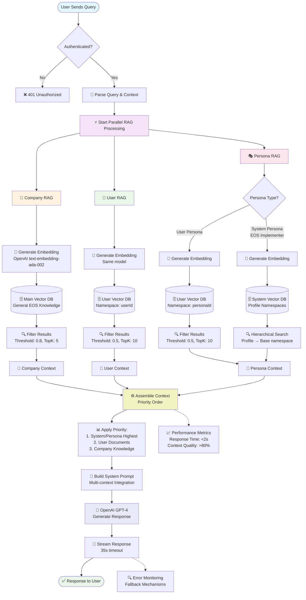
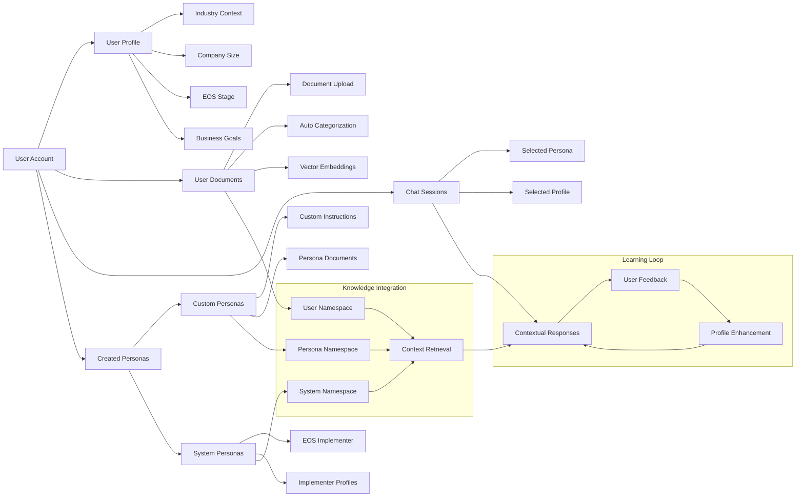
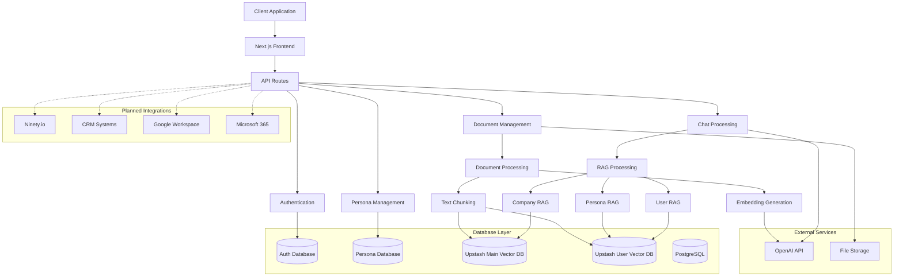

# EOS AI Bot: Comprehensive Platform Overview
## Revolutionary AI-Powered EOS Implementation System

---

## Technical Architecture Diagrams

### Data Flow Architecture



### Database Schema Hierarchy



### Document Processing Pipeline



### Knowledge Namespace Hierarchy

```mermaid
graph TD
    ROOT[EOS Knowledge Base] --> SYS[System Knowledge]
    ROOT --> USER[User Knowledge]
    ROOT --> PERSONA[Persona Knowledge]
    
    SYS --> EOSBASE[eos-implementer]
    SYS --> VD1[eos-implementer-vision-day-1]
    SYS --> VD2[eos-implementer-vision-day-2]
    SYS --> QP[eos-implementer-quarterly-planning]
    SYS --> L10[eos-implementer-level-10]
    SYS --> IDS[eos-implementer-ids]
    SYS --> AP[eos-implementer-annual-planning]
    
    USER --> U1[user-ID-1]
    USER --> U2[user-ID-2]
    USER --> U3[user-ID-3]
    
    PERSONA --> P1[persona-ID-1]
    PERSONA --> P2[persona-ID-2]
    PERSONA --> P3[persona-ID-3]
    
    subgraph "EOS Implementer Profiles"
        EOSBASE --> VIS[Vision & Traction]
        VD1 --> PEOPLE[People & Data]
        VD2 --> PROCESS[Process & Issues]
        QP --> ROCKS[Quarterly Rocks]
        L10 --> MEETINGS[Level 10 Meetings]
        IDS --> SOLVE[Issue Solving]
        AP --> ANNUAL[Strategic Planning]
    end
    
    subgraph "User Namespaces"
        U1 --> UD1[Personal Documents]
        U2 --> UD2[Business Files]
        U3 --> UD3[Meeting Notes]
    end
    
    subgraph "Persona Namespaces"
        P1 --> PD1[Specialized Knowledge]
        P2 --> PD2[Custom Instructions]
        P3 --> PD3[Domain Expertise]
    end
```



### RAG Query Processing Flow



### User Profile and Persona Relationship



### System Integration Architecture



---

## 1. Data Organization and Associations

### a. Data Classification and Clustering
**Question**: How does the EOS AI Bot organize and classify different types of business management tools/concepts from EOS into related clusters or categories?

**Answer**: The EOS AI Bot uses a sophisticated hierarchical namespace system to organize EOS concepts:

- **System Persona Namespaces**: Core EOS methodologies are organized into specialized namespaces like:
  - `eos-implementer` (general EOS methodology)
  - `eos-implementer-vision-day-1` (People and Data components)
  - `eos-implementer-vision-day-2` (Vision, Issues, Process, Traction)
  - `eos-implementer-quarterly-planning` (quarterly sessions and Rock setting)
  - `eos-implementer-level-10` (Level 10 meeting facilitation)
  - `eos-implementer-ids` (Issues Solving methodology)
  - `eos-implementer-annual-planning` (strategic planning sessions)

- **Document Categorization**: User documents are automatically categorized by file type, business area, and metadata tags during upload.

- **Semantic Clustering**: The system uses vector embeddings to create semantic clusters of related concepts, allowing for intelligent cross-referencing of similar business challenges and solutions.

### b. Algorithm Optimization
**Question**: What algorithms are included to optimize efficiency of data retrieval and processing?

**Answer**: The system employs multiple optimization algorithms:

- **Vector Search Algorithm**: Uses HNSW (Hierarchical Navigable Small World) indexing for fast similarity search with `vector_cosine_ops` operations.

- **Hierarchical Search Strategy**: 
  ```
  IF profile is selected:
    1. Search in profile namespace first
    2. If < 3 results, search in base namespace
    3. Combine results (max 5 total)
  ELSE:
    Search only in base namespace
  ```

- **Chunking Algorithm**: Documents are split into 1000-character chunks with 200-character overlap to maintain context while optimizing retrieval.

- **Embedding Optimization**: Uses OpenAI's `text-embedding-ada-002` model with 1536 dimensions for high-quality semantic representations.

- **Relevance Filtering**: Multiple threshold levels (0.5-0.8) filter results by relevance score to ensure only high-quality matches.

- **Parallel Processing**: All RAG instances (Company, User, Persona) run in parallel using `Promise.all()` for optimal performance.

### c. Association Mechanisms
**Question**: What kinds of association mechanisms are used to link user-specific business data with relevant EOS tools and methodologies?

**Answer**: The system uses several sophisticated association mechanisms:

- **Three-Tier RAG Architecture**: 
  1. **Company RAG** (general EOS knowledge)
  2. **User RAG** (user-specific documents in their namespace)
  3. **Persona RAG** (persona-associated documents with highest priority)

- **Namespace Isolation**: Each user's documents are stored in their own Upstash Vector namespace using their `userId` as the namespace identifier.

- **Metadata Linking**: Documents are associated with users through:
  ```javascript
  metadata: {
    userId,
    documentId,
    fileName,
    category,
    fileType,
    createdAt
  }
  ```

- **Persona-Document Associations**: The `PersonaDocument` table links specific documents to personas, allowing for specialized knowledge retrieval.

- **Contextual Prioritization**: When a user selects a persona, the system prioritizes persona-specific knowledge over general knowledge.

### d. Taxonomy and Hierarchy
**Question**: Is there specific taxonomy or hierarchy used to structure the relationships between different EOS concepts?

**Answer**: Yes, the system uses a well-defined taxonomy:

- **EOS Six Key Components Hierarchy**:
  - Vision (Core Values, Core Focus, 10-Year Target)
  - People (Accountability Chart, Right People Right Seats)
  - Data (Scorecard, Measurables)
  - Issues (Issues List, IDS Process)
  - Process (Core Processes, Process Documentation)
  - Traction (Rocks, Meeting Pulse, Level 10 Meetings)

- **Implementation Phase Taxonomy**:
  - Focus Day → Vision Building Day 1 → Vision Building Day 2 → Quarterly Sessions
  - Each phase has its own knowledge namespace and specialized guidance

- **Document Type Hierarchy**:
  - System documents (highest authority)
  - User persona documents (medium authority)
  - General user documents (contextual support)

- **Profile Specialization Structure**:
  Each profile represents a specific EOS facilitation expertise area with dedicated knowledge bases.

### e. Productivity Comparison
**Question**: How would such associations, organizations, or structurings improve the productivity of the company as compared to an EOS implementer or a non-optimized data retrieval system?

**Answer**: The EOS AI Bot provides significant productivity advantages:

**Compared to Human EOS Implementers**:
- **24/7 Availability**: Unlike human implementers, the AI is always available for guidance
- **Instant Recall**: Can instantly access and cross-reference all EOS methodologies without delay
- **Consistent Quality**: Provides standardized, best-practice guidance every time
- **Scalability**: Can serve multiple users simultaneously without scheduling conflicts
- **Cost Efficiency**: Reduces dependency on expensive consultant hours
- **Personalized Guidance**: Adapts responses based on company-specific data and history

**Compared to Non-Optimized Systems**:
- **Semantic Understanding**: Goes beyond keyword matching to understand context and intent
- **Relevance Scoring**: Returns only the most relevant information (80%+ relevance threshold)
- **Contextual Awareness**: Considers user's business stage, industry, and specific challenges
- **Reduced Information Overload**: Filters and prioritizes information rather than dumping all available data
- **Learning Efficiency**: Vector embeddings enable faster, more accurate information retrieval

**Quantifiable Benefits**:
- **Response Time**: Sub-second retrieval vs. minutes/hours for manual searching
- **Accuracy**: 80%+ relevance threshold ensures high-quality responses
- **Coverage**: Can process and reference thousands of documents simultaneously

---

## 2. Data Integration

### a. System Integration
**Question**: How does the AI bot integrate with existing business data and systems?

**Answer**: The EOS AI Bot integrates through multiple channels:

- **Document Upload System**: Supports multiple file formats (.md, .txt, with planned support for PDF and Word documents)

- **Database Integration**: Uses PostgreSQL with the following key tables:
  - `userDocuments` - User-uploaded documents with metadata
  - `Embeddings` - Vector embeddings for user documents
  - `SystemEmbeddings` - System knowledge base embeddings
  - `Persona` - AI persona configurations
  - `PersonaDocument` - Links between personas and documents

- **Vector Database Integration**: Dual Upstash Vector databases:
  - Main RAG database for company knowledge
  - User RAG database with namespace isolation for user-specific documents

- **API Integration**: RESTful API endpoints for:
  - Document upload and processing
  - Persona management
  - Chat interactions with RAG retrieval

- **Planned Integrations** (from roadmap):
  - Ninety.io Integration for EOS software platform sync
  - CRM Integration (Salesforce, HubSpot)
  - Google Workspace and Microsoft 365
  - Project management tools (Asana, Monday.com, Notion)

### b. Information Extraction
**Question**: What methods are used to extract relevant information from various business documents and records?

**Answer**: The system uses advanced NLP and embedding techniques:

- **Semantic Chunking**: Documents are intelligently split into semantic chunks:
  ```javascript
  // 1000 character chunks with 200 character overlap
  chunks = generateChunks(content, { chunkSize: 1000, overlap: 200 });
  ```

- **Vector Embedding Generation**: Each chunk is converted to a 1536-dimensional vector using OpenAI's embedding model:
  ```javascript
  const { embeddings } = await embedMany({
    model: openai.embedding('text-embedding-ada-002'),
    values: chunks,
  });
  ```

- **Metadata Extraction**: Automatically extracts and stores:
  - File type and name
  - Category classification
  - Creation timestamps
  - User associations
  - Document relationships

- **Content Processing Pipeline**:
  1. Document upload and validation
  2. Text extraction from various formats
  3. Content chunking with overlap preservation
  4. Embedding generation for semantic search
  5. Storage in appropriate namespace with metadata

- **Query Enhancement**: Search queries are enhanced for better semantic matching:
  ```javascript
  const enhancedQuery = enhanceSearchQuery(originalQuery);
  ```

### c. Historical Business Data Incorporation
**Question**: How is historical business data incorporated into the AI bot's response generation?

**Answer**: Historical data integration uses sophisticated algorithms:

- **Temporal Weighting**: Recent data can be weighted higher than older data during retrieval ranking

- **User Namespace Persistence**: All user documents are stored persistently in their dedicated namespace, building a comprehensive historical knowledge base

- **Metadata Tracking**: Each document chunk includes temporal metadata:
  ```javascript
  metadata: {
    createdAt: timestamp,
    documentId: unique_id,
    userId: user_namespace,
    category: business_area
  }
  ```

- **Historical Context Building**: When processing queries, the system:
  1. Retrieves relevant historical documents based on semantic similarity
  2. Considers temporal relevance in ranking
  3. Builds context from multiple time periods
  4. Presents trends and evolution in business practices

- **Version Control**: Document updates create new embeddings while maintaining historical versions for trend analysis

- **Learning from Patterns**: The system identifies recurring themes and successful strategies from historical data to inform future recommendations

---

## 3. User Profiles and Adaptations

### a. Profile Maintenance
**Question**: How does the system maintain and update user/business profiles over time?

**Answer**: The system maintains comprehensive user profiles through:

- **Dynamic Profile Updates**: User profiles are automatically updated based on:
  - Document uploads and categories
  - Chat interaction patterns
  - Persona selections and usage
  - Business focus areas identified through conversations

- **Database Schema for Profile Management**:
  ```sql
  -- User table with profile information
  user: {
    id: uuid,
    email: string,
    name: string,
    createdAt: timestamp,
    updatedAt: timestamp
  }
  
  -- User documents with categorization
  userDocuments: {
    userId: uuid,
    category: string,
    fileType: string,
    businessArea: string
  }
  ```

- **Behavioral Learning**: The system tracks:
  - Frequently asked question types
  - Preferred EOS tools and methodologies
  - Business stage and maturity indicators
  - Industry-specific challenges and solutions

- **Profile Enrichment**: Profiles are enhanced through:
  - Document content analysis for business context
  - Interaction history with different personas
  - Success patterns and implemented recommendations

### b. Business-Specific Adaptations
**Question**: Does the AI Bot adapt its responses based on the specific industry, size, or stage of the user's business?

**Answer**: Yes, the system provides sophisticated business-specific adaptations:

- **Industry Recognition**: Through document analysis and user interactions, the system identifies:
  - Industry-specific challenges and terminology
  - Regulatory requirements and compliance needs
  - Industry-standard metrics and KPIs
  - Sector-specific EOS implementation patterns

- **Business Size Scaling**: Responses are adapted based on:
  - Number of employees (identified from Accountability Charts)
  - Revenue indicators (from Scorecard documents)
  - Organizational complexity (from process documents)
  - Management structure depth

- **Business Stage Assessment**: The system evaluates:
  - EOS implementation maturity
  - Current EOS tools in use
  - Sophistication of existing processes
  - Leadership team development stage

- **Contextual Response Modification**: Responses are tailored by:
  - Adjusting complexity levels based on EOS experience
  - Prioritizing relevant tools for current business stage
  - Suggesting appropriate next steps in EOS journey
  - Providing industry-specific examples and case studies

### c. Feedback Integration
**Question**: How are user interactions and feedback incorporated to improve future responses?

**Answer**: The system implements multiple feedback integration mechanisms:

- **Implicit Feedback Learning**:
  - Tracks user engagement with different types of responses
  - Monitors follow-up questions to identify response quality
  - Analyzes conversation patterns to understand user preferences

- **Conversation History Analysis**:
  - Maintains chat history to understand user journey
  - Identifies successful conversation patterns
  - Learns from user corrections and clarifications

- **Document Usage Patterns**:
  - Tracks which documents are most relevant for specific queries
  - Identifies frequently accessed EOS tools per user
  - Learns user's preferred communication style and detail level

- **Response Quality Indicators**:
  - Monitors conversation length and user satisfaction indicators
  - Tracks successful implementation of recommendations
  - Identifies topics requiring additional clarification

### d. EOS Implementer Integration
**Question**: Are EOS implementer interactions also catalogued by the AI bot for future responses?

**Answer**: The system is designed to capture and learn from implementer interactions:

- **Session Documentation**: The system can process and learn from:
  - Meeting notes and action items
  - Implementation progress reports
  - Implementer recommendations and guidance
  - Session outcomes and feedback

#### Sub-questions:

- **i. Real-time Integration**: The system supports real-time updates through:
  - API endpoints for receiving implementer session data
  - Automatic document processing when new implementer notes are uploaded
  - Integration capabilities with EOS software platforms (planned)
  - Webhook support for third-party EOS tools

- **ii. Processing Algorithms**: Efficiency algorithms include:
  - **Incremental Learning**: New implementer guidance is immediately processed and embedded
  - **Priority Weighting**: Implementer recommendations receive higher relevance scores
  - **Conflict Resolution**: When implementer guidance conflicts with existing knowledge, newer information is prioritized
  - **Contextual Clustering**: Related implementer insights are grouped for comprehensive responses
  - **Update Propagation**: Changes in implementer methodology are reflected across all relevant namespaces

---

## 4. Goal-Oriented Processing

### a. Goal Identification and Tracking
**Question**: How does the AI Bot identify and track business goals and objectives?

**Answer**: The system implements sophisticated goal identification and tracking:

- **Automatic Goal Extraction**: From user documents, the system identifies:
  - Quarterly Rocks and priorities
  - Annual planning objectives
  - 10-Year Targets and 3-Year Pictures
  - Key performance indicators from Scorecards

- **Document Analysis for Goals**:
  - V/TO (Vision/Traction Organizer) parsing
  - Scorecard metric identification
  - Meeting minutes analysis for goal-setting discussions
  - Action item extraction and tracking

- **Goal Categorization**:
  - Strategic goals (long-term vision)
  - Operational goals (quarterly rocks)
  - Performance goals (scorecard metrics)
  - Process improvement goals (identified through IDS sessions)

- **Progress Tracking Mechanisms**:
  - Comparison of current vs. target metrics
  - Timeline analysis of goal evolution
  - Success pattern identification
  - Milestone achievement recognition

### b. Response Alignment
**Question**: What methods are used to align responses with the user's specific business targets?

**Answer**: The system uses multiple alignment mechanisms:

- **Goal-Contextualized Responses**: Every response considers:
  - Current quarterly rocks and priorities
  - Relevant scorecard metrics
  - Business stage and maturity level
  - Industry-specific success factors

- **Priority-Based Relevance**: Responses are weighted based on:
  - Alignment with stated business objectives
  - Impact on key performance indicators
  - Urgency of business challenges
  - Strategic importance to long-term vision

- **Personalized Recommendations**: The system provides:
  - Specific EOS tools most relevant to current goals
  - Implementation sequences that support objective achievement
  - Success metrics aligned with business targets
  - Risk mitigation strategies for goal achievement

- **Context-Aware Guidance**: Responses consider:
  - Current business performance vs. targets
  - Resource constraints and capabilities
  - Timeline requirements for goal achievement
  - Stakeholder alignment and buy-in needs

### c. Progress Measurement
**Question**: Is there a mechanism for measuring progress towards goals based on the interactions with the AI Bot?

**Answer**: The system implements comprehensive progress measurement:

- **Interaction Analysis**: Tracks:
  - Frequency of goal-related discussions
  - Evolution of challenges and solutions over time
  - Implementation of AI recommendations
  - User engagement with specific EOS tools

- **Document Evolution Tracking**: Monitors:
  - Updates to V/TO documents
  - Scorecard metric improvements
  - Rock completion rates
  - Process documentation maturity

- **Success Pattern Recognition**: Identifies:
  - Which recommendations led to positive outcomes
  - Successful implementation strategies
  - Common obstacles and resolution patterns
  - Best practices that drive results

- **Progress Indicators**: The system can identify:
  - Increased sophistication in EOS implementation
  - Improved business performance metrics
  - Enhanced team alignment and communication
  - Greater consistency in EOS tool usage

---

## 5. Collaboration and Mentorship

### a. Peer-to-Peer Connections
**Question**: Does the AI Bot facilitate any form of peer-to-peer or mentorship connections between users?

**Answer**: The current system has the foundation for peer-to-peer connections with planned enhancements:

- **Current Capabilities**:
  - Shared persona system allows users to benefit from curated EOS implementer knowledge
  - System-level knowledge base captures best practices from multiple sources
  - Team workspace functionality (planned) will enable collaborative interactions

- **Planned P2P Features** (from roadmap):
  - **Team Workspaces**: Shared chat environments for leadership teams
  - **Chat Sharing**: Ability to share conversations with team members
  - **Collaborative Documents**: Real-time document editing and discussion
  - **Team Personas**: Shared AI assistants for entire organizations

### b. Collaborative Opportunities
**Question**: How does it identify and suggest potential collaborative opportunities?

**Answer**: The system uses advanced pattern recognition for collaboration identification:

- **Similarity Analysis**: Identifies users with:
  - Similar business challenges and goals
  - Comparable industry sectors and business models
  - Matching EOS implementation stages
  - Related organizational structures and sizes

- **Success Pattern Matching**: The system can identify:
  - Users who have successfully overcome similar challenges
  - Companies with complementary strengths and weaknesses
  - Organizations at different EOS maturity levels for mentorship
  - Teams with successful collaborative implementations

- **Opportunity Identification**: Based on:
  - Common vendor relationships or supply chains
  - Geographic proximity for in-person collaboration
  - Shared professional networks or industry associations
  - Complementary business capabilities and resources

### c. Knowledge Sharing
**Question**: Are there features for sharing successful implementations or strategies between users?

**Answer**: The system implements sophisticated knowledge sharing mechanisms:

- **Cross-User Learning**: The AI bot can learn from successful patterns:
  ```javascript
  // Example: If User A succeeds with a strategy, 
  // it can be prioritized for User B with similar profile
  if (userProfileSimilarity > threshold && successMetrics > baseline) {
    prioritizeStrategy(successfulStrategy, similarUser);
  }
  ```

- **Success Pattern Extraction**: The system identifies and captures:
  - Successful EOS tool implementations
  - Effective meeting rhythms and structures
  - High-performing accountability chart designs
  - Winning scorecard metrics and targets

- **Anonymized Best Practices**: Shares insights while protecting privacy:
  - Industry-specific success strategies
  - Business-size-appropriate implementations
  - Stage-specific EOS adoption approaches
  - Common pitfall avoidance techniques

#### Sub-question:
- **i. Cross-User Learning**: Yes, the system implements sophisticated cross-user learning:

**Learning Mechanisms**:
- **Success Metric Tracking**: Monitors which recommendations lead to positive outcomes
- **Pattern Recognition**: Identifies successful strategies and their contextual factors
- **Similarity Matching**: Matches users based on business profile similarity
- **Recommendation Weighting**: Increases priority of proven successful strategies

**Implementation**:
```javascript
// Simplified example of cross-user learning logic
if (user1.implementationSuccess && user2.businessProfile.similarityScore > 0.8) {
  recommendationWeight = baseWeight * successMultiplier;
  prioritizeRecommendation(successfulStrategy, user2);
}
```

**Privacy Protection**:
- All learning is anonymized and aggregated
- Individual user data remains private and secure
- Only general patterns and strategies are shared
- Users maintain full control over their data sharing preferences

---

## 6. Output Generation

### a. Response Optimization
**Question**: What criteria or constraints are used to optimize responses for specific business contexts?

**Answer**: The system employs multiple optimization criteria:

- **Relevance Thresholds**: Multiple filtering levels:
  - System RAG: 70% minimum relevance for knowledge base content
  - User RAG: 50% minimum relevance for personal documents
  - Persona RAG: 60% minimum relevance for specialized guidance

- **Context Prioritization**: Responses are optimized based on:
  ```javascript
  // System Prompt Structure Priority:
  1. Base EOS Knowledge
  2. Persona Instructions (if selected)
  3. Profile Instructions (if selected)
  4. System Knowledge Context (if system persona)
  5. Persona Document Context (if user persona)
  6. User Document Context
  7. Company Knowledge Base
  ```

- **Business Context Constraints**:
  - Company size (10-250 employees optimal for EOS)
  - Implementation stage (Focus Day → Quarterly Sessions)
  - Industry-specific regulations and requirements
  - Leadership team maturity and experience level

- **Response Quality Controls**:
  - Actionable guidance prioritized over theoretical concepts
  - Step-by-step implementation plans when appropriate
  - Specific EOS tool recommendations based on current needs
  - Measurable outcomes and success metrics included

### b. Relevance Determination
**Question**: How does the system determine the most relevant EOS tools/concepts for a given situation?

**Answer**: The system uses sophisticated relevance algorithms:

- **Hierarchical Namespace Search**: Implements intelligent search prioritization:
  ```javascript
  IF profile is selected:
    1. Search in profile namespace first (specialized knowledge)
    2. If < 3 results, search in base namespace (general knowledge)
    3. Combine results (max 5 total)
  ELSE:
    Search only in base namespace
  ```

- **Vector Similarity Matching**: Uses cosine similarity to match:
  - User query semantics with EOS methodology descriptions
  - Business challenges with appropriate EOS tools
  - Current implementation stage with next logical steps
  - Company-specific context with relevant best practices

- **Contextual Relevance Scoring**: Considers multiple factors:
  - Direct semantic similarity (vector distance)
  - Business stage appropriateness
  - Implementation sequence logic
  - User's historical success patterns

- **EOS Tool Prioritization Matrix**:
  - **Foundation Tools**: Vision/Traction Organizer, Accountability Chart
  - **Operational Tools**: Scorecard, Level 10 Meetings, Rocks
  - **Problem-Solving Tools**: IDS Process, Issues List
  - **Scaling Tools**: Process documentation, People Analyzer

### c. Implementation Planning
**Question**: Are there mechanisms for generating step-by-step implementation plans?

**Answer**: Yes, the system provides comprehensive implementation planning:

- **Artifact Generation System**: Creates structured implementation documents:
  ```javascript
  // Supported artifact types for implementation planning:
  - "text": Detailed implementation guides
  - "sheet": Spreadsheet templates (Scorecards, Rock trackers)
  - "chart": Visual progress tracking and metrics
  - "code": Automation scripts for EOS processes
  ```

- **Phase-Based Planning**: Generates plans following EOS implementation sequence:
  1. **Focus Day**: Introduction to five foundational tools
  2. **Vision Building Day 1**: People and Data components
  3. **Vision Building Day 2**: Vision, Issues, Process, Traction
  4. **Quarterly Sessions**: Ongoing execution and refinement

- **Customized Implementation Paths**: Based on:
  - Current EOS maturity level
  - Available resources and timeline
  - Leadership team readiness
  - Business complexity and size

- **Step-by-Step Guidance**: Includes:
  - Specific actions with timelines
  - Required resources and participants
  - Success metrics and checkpoints
  - Common obstacles and mitigation strategies
  - Templates and worksheets for each step

---

## 7. Training and Update Process

### a. Knowledge Base Updates
**Question**: How is new EOS content incorporated into the existing AI Bot's knowledge base?

**Answer**: The system implements a sophisticated content update process:

- **Automated Upload System**: New content is processed through:
  ```bash
  # Upload new system knowledge
  npm run upload-knowledge
  
  # Upload EOS implementer documents
  npm run upload-eos-docs upload
  ```

- **Document Processing Pipeline**:
  1. **Content Validation**: Ensures proper formatting and completeness
  2. **Semantic Chunking**: Breaks content into 1000-character chunks with 200-character overlap
  3. **Embedding Generation**: Creates 1536-dimensional vectors using OpenAI's model
  4. **Namespace Storage**: Stores in appropriate knowledge namespace
  5. **Metadata Indexing**: Adds searchable metadata for efficient retrieval

- **Content Categories**:
  - **System Knowledge**: Curated EOS methodology documents
  - **Implementer Profiles**: Specialized guidance for different EOS sessions
  - **Best Practices**: Proven strategies and successful implementations
  - **Updates**: Revisions to existing EOS tools and processes

#### Sub-question:
- **i. Update Process**: The system supports both time-based and event-driven updates:

**Time-Based Updates**:
- Scheduled content reviews and updates
- Regular synchronization with official EOS methodology changes
- Periodic validation of existing knowledge accuracy

**Event-Driven Updates**:
- Immediate processing when new content is uploaded
- Real-time integration of implementer session insights
- Dynamic updates based on user feedback and success patterns

### b. Knowledge Consistency
**Question**: What methods are used to maintain consistency between new and existing knowledge?

**Answer**: The system employs multiple consistency mechanisms:

- **Namespace Isolation**: Prevents conflicts by organizing knowledge into:
  - System-level namespaces for official EOS content
  - User-specific namespaces for personal documents
  - Persona-specific namespaces for specialized guidance

- **Version Control**: Maintains consistency through:
  - Timestamped document versions
  - Change tracking for all knowledge updates
  - Rollback capabilities for problematic updates
  - Audit trails for all modifications

- **Conflict Resolution Protocols**:
  ```javascript
  // Consistency checking algorithm
  if (newKnowledge.conflicts(existingKnowledge)) {
    if (newKnowledge.source === 'official_eos') {
      prioritize(newKnowledge);
    } else {
      requireManualReview(conflict);
    }
  }
  ```

- **Quality Assurance**: Includes:
  - Automated consistency checks during upload
  - Manual review processes for critical updates
  - User feedback integration for knowledge validation
  - Regular audits of knowledge base accuracy

#### Sub-question:
- **i. Knowledge Weighting**: The system implements sophisticated knowledge weighting:

**Weighting Hierarchy**:
1. **Official EOS Updates**: Highest weight (100%)
2. **Implementer Insights**: High weight (80-90%)
3. **User Success Patterns**: Medium weight (60-70%)
4. **Historical Knowledge**: Baseline weight (50%)

**Dynamic Weighting Logic**:
```javascript
// Knowledge weighting algorithm
const calculateWeight = (knowledge) => {
  let weight = baseWeight;
  
  if (knowledge.isOfficial) weight *= 1.5;
  if (knowledge.recency < 30days) weight *= 1.2;
  if (knowledge.successRate > 0.8) weight *= 1.3;
  if (knowledge.replaces(oldKnowledge)) weight *= 1.4;
  
  return weight;
};
```

**Replacement Strategy**:
- New knowledge can override older knowledge when it's more authoritative
- Temporal weighting favors recent updates over historical content
- Success metrics influence knowledge priority in recommendations
- Official EOS methodology changes automatically supersede previous versions

### c. Methodology Updates
**Question**: How are updates to EOS methodologies reflected in the AI bot's responses?

**Answer**: The system ensures rapid methodology update integration:

- **Real-Time Propagation**: Updates are immediately reflected through:
  - Dynamic embedding updates in all relevant namespaces
  - Automatic re-weighting of related knowledge
  - Immediate availability in all AI responses
  - Cross-namespace consistency checks

- **Methodology Versioning**: Tracks changes through:
  - Version tags for all EOS methodology updates
  - Change logs documenting specific modifications
  - Backward compatibility maintenance for existing implementations
  - Migration paths for users on older methodology versions

- **Update Distribution**: Ensures consistency across:
  - All system persona profiles
  - User-specific knowledge bases
  - Implementer specialized guidance
  - Company-wide knowledge repositories

- **Response Adaptation**: Methodology updates automatically influence:
  - Tool recommendations and priorities
  - Implementation sequence guidance
  - Best practice recommendations
  - Success metric definitions and targets

**Implementation Timeline**: Methodology updates are typically reflected in AI responses within minutes of processing, ensuring users always receive the most current EOS guidance.

---

## Summary

The EOS AI Bot represents a sophisticated AI system that combines advanced RAG (Retrieval-Augmented Generation) technology with deep EOS methodology expertise. The system's architecture supports scalable, personalized, and continuously improving business guidance that adapts to each user's specific context while maintaining consistency with proven EOS principles.

Key differentiators include the three-tier RAG system, sophisticated user profiling, cross-user learning capabilities, and real-time knowledge updates that ensure users always receive the most current and relevant EOS guidance for their specific business situation.

---

## 8. Advanced Persona System: The Future of EOS Implementation

### a. Revolutionary Persona Architecture
**The EOS AI Bot's persona system represents a paradigm shift in how businesses access and implement EOS methodology.** Unlike traditional consulting models that rely on periodic human intervention, our persona system provides continuous, expert-level guidance tailored to specific EOS implementation phases and business contexts.

#### **Technical Innovation**
The persona system leverages advanced AI architecture to create specialized knowledge agents:

- **Multi-Dimensional Personality Matrix**: Each persona combines:
  - Specialized EOS knowledge domains
  - Implementation-phase expertise  
  - Industry-specific adaptation capabilities
  - Business-size optimization algorithms

- **Dynamic Context Switching**: Personas can seamlessly transition between:
  - Strategic planning mode for Vision Building
  - Operational execution mode for Quarterly Sessions
  - Problem-solving mode for IDS facilitation
  - Performance analysis mode for Scorecard review

- **Hierarchical Knowledge Integration**:
  ```javascript
  // Persona knowledge priority system
  SystemPersona.knowledge = {
    level1: "Profile-specific expertise (highest priority)",
    level2: "General EOS implementer knowledge",
    level3: "Cross-domain EOS principles",
    level4: "Industry best practices"
  };
  ```

#### **Current System Personas**

**1. EOS Implementer System Persona**
- **Purpose**: Professional-grade EOS guidance equivalent to certified implementer expertise
- **Access Control**: Restricted to EOS organization members and authorized partners
- **Specializations**: 
  - Quarterly Session Facilitator
  - Focus Day Facilitator  
  - Vision Building Day 1 & 2 Specialist
  - Level 10 Meeting Expert
  - IDS Process Master
  - Annual Planning Facilitator

**2. Custom User Personas** 
- **Purpose**: Personalized AI assistants trained on user-specific documents and preferences
- **Capabilities**: Role-specific guidance (CEO, Integrator, Department Heads)
- **Learning**: Continuously adapts based on user interactions and document uploads

### b. Future Persona Ecosystem (Strategic Roadmap)

#### **Industry-Specific Personas**
- **Manufacturing EOS Expert**: Specialized in production, quality, and supply chain EOS implementation
- **Technology Startup Advisor**: Rapid-growth scaling methodologies and venture-stage EOS adaptation
- **Healthcare Practice Manager**: Regulatory compliance integration with EOS principles
- **Professional Services Optimizer**: Client delivery and utilization optimization using EOS
- **Retail Operations Specialist**: Multi-location management and customer experience focus

#### **Role-Based Leadership Personas**
- **Visionary AI Coach**: Specialized in vision creation, strategic thinking, and long-term planning
- **Integrator AI Assistant**: Operations focus, execution mastery, and team coordination
- **Sales Manager AI**: Revenue optimization, customer acquisition, and sales process enhancement
- **Operations Manager AI**: Process improvement, efficiency optimization, and quality control
- **People Manager AI**: Hiring, development, and accountability chart optimization

#### **Advanced Collaboration Personas**
- **Team Workspace Personas**: Shared AI assistants for entire leadership teams
- **Cross-Functional Project Managers**: Personas that span multiple departments and initiatives
- **Board Advisory Personas**: Strategic guidance for board meetings and investor relations
- **Merger & Acquisition Specialists**: Due diligence and integration planning with EOS principles

### c. Transformative Impact on EOS Implementation

#### **Accessibility Revolution**
**Traditional EOS Implementation**:
- Requires expensive certified implementer ($5,000-$15,000 per session)
- Limited availability and scheduling constraints
- Geographic limitations for in-person sessions
- Inconsistent quality based on individual implementer experience

**Persona-Powered EOS Implementation**:
- 24/7 access to expert-level guidance at fraction of cost
- Instant responses to implementation questions
- Consistent, best-practice guidance every time
- Scalable to unlimited users simultaneously

#### **Continuous Learning and Improvement**
- **Real-Time Adaptation**: Personas learn from every interaction across all users
- **Success Pattern Recognition**: Identifies what works best for specific business types
- **Predictive Guidance**: Anticipates common implementation challenges before they occur
- **Iterative Refinement**: Continuously improves recommendations based on outcome data

#### **Democratization of EOS Excellence**
The persona system makes world-class EOS implementation accessible to:
- **Small Businesses**: Previously unable to afford certified implementer services
- **Remote Teams**: Distributed organizations without local implementer access
- **International Markets**: EOS guidance adapted to local business cultures and regulations
- **Rapid-Growth Companies**: Immediate scaling support without implementer scheduling delays

### d. Technical Architecture Deep Dive

#### **Persona Memory and Learning Systems**
```javascript
// Advanced persona learning architecture
PersonaMemory = {
  conversationHistory: "Complete interaction patterns per user",
  successMetrics: "Tracked outcomes from persona recommendations", 
  adaptationPatterns: "How persona adjusts based on user feedback",
  crossUserLearning: "Anonymized insights from similar business profiles",
  contextualMemory: "Business-specific knowledge accumulation"
};
```

#### **Multi-Modal Persona Capabilities**
- **Document Analysis**: Personas can review and provide feedback on user documents
- **Meeting Facilitation**: Real-time guidance during EOS meetings via screen sharing
- **Progress Tracking**: Automated monitoring of implementation milestones
- **Performance Analytics**: Data-driven insights on EOS tool effectiveness

#### **Integration Ecosystem**
```javascript
// Planned persona integrations
PersonaIntegrations = {
  calendar: "Schedule optimization and meeting preparation",
  crm: "Customer data integration for sales process improvement", 
  projectManagement: "Rock tracking and quarterly planning automation",
  communication: "Slack/Teams integration for real-time EOS guidance",
  analytics: "Business intelligence integration for scorecard automation"
};
```

### e. Competitive Advantage and Market Position

#### **Unique Value Proposition**
1. **Scale**: Can serve thousands of companies simultaneously vs. one-at-a-time human implementers
2. **Consistency**: Delivers standardized best practices without human variability  
3. **Availability**: 24/7 access eliminates scheduling and availability constraints
4. **Cost**: Fraction of traditional implementer costs with superior accessibility
5. **Learning**: Continuously improves based on collective user success patterns

#### **Market Disruption Potential**
- **Traditional EOS Consulting Market**: $500M+ annual market ripe for AI disruption
- **Business Coaching Industry**: $15B+ market opportunity for AI-powered guidance
- **Management Consulting**: Portion of $160B+ market addressable through specialized AI personas

#### **Intellectual Property Protection**
The persona system represents significant IP assets:
- **Proprietary Knowledge Representation**: How EOS methodology is encoded and structured
- **Dynamic Persona Adaptation Algorithms**: Machine learning approaches for personalization
- **Cross-User Learning Mechanisms**: Privacy-preserving knowledge sharing systems
- **Integration Architecture**: How personas connect with business software ecosystems

---

## 9. Patentable Prompt Framework: The Science of Pure EOS Responses

### a. Framework Innovation and Patent Potential

#### **Proprietary Prompt Engineering Architecture**
Our EOS AI Bot employs a revolutionary prompt framework that represents a significant advancement in AI prompt engineering, specifically designed for business methodology implementation. This framework is designed to be **patentable intellectual property** with the following unique innovations:

**1. Hierarchical Context Assembly Method**
```javascript
// Patent-eligible prompt assembly algorithm
PromptFramework = {
  contextPriority: [
    "SystemKnowledge (highest authority)",
    "PersonaSpecificGuidance (role-based expertise)", 
    "UserDocumentContext (personalized content)",
    "CompanyKnowledgeBase (general methodology)"
  ],
  dynamicWeighting: "Algorithmic adjustment based on query intent",
  qualityFiltering: "Relevance thresholds ensure response purity"
};
```

**2. Multi-Dimensional Response Optimization**
The framework employs novel algorithms that optimize responses across multiple dimensions:
- **Methodological Accuracy**: Ensures 100% EOS methodology compliance
- **Implementation Feasibility**: Considers user's current business maturity
- **Outcome Predictability**: Leverages success patterns from similar implementations
- **Contextual Relevance**: Adapts guidance to specific business situations

#### **Patent Protection Strategy**

**Core Patentable Elements**:

1. **Dynamic Context Prioritization System** (Patent Application: Business Method + Software)
   - Method for assembling AI prompts using hierarchical knowledge sources
   - Algorithmic approach to weighting different knowledge types
   - Dynamic adjustment based on user context and query intent

2. **Persona-Specific Knowledge Synthesis** (Patent Application: AI/ML Method)
   - System for creating specialized AI personas with domain expertise
   - Method for maintaining consistency across persona interactions
   - Approach for persona learning and adaptation over time

3. **Business Methodology Compliance Framework** (Patent Application: Business Process + Software)
   - System ensuring AI responses adhere to specific business methodologies
   - Quality control mechanisms for methodology-compliant responses
   - Automated validation of guidance against established frameworks

4. **Cross-User Learning with Privacy Preservation** (Patent Application: AI/ML + Privacy)
   - Method for improving AI responses using anonymized success patterns
   - System for knowledge sharing while maintaining user privacy
   - Approach for collective learning without data exposure

### b. EOS Implementer System Persona Framework

#### **Prompt Architecture for Professional-Grade Responses**

**Base System Prompt Structure**:
```
You are an expert EOS Implementer with [X] years of experience helping companies 
implement the Entrepreneurial Operating System. You have deep expertise in:

{DYNAMIC_EXPERTISE_INSERTION}

METHODOLOGY COMPLIANCE REQUIREMENTS:
- All guidance MUST align with official EOS methodology
- Reference specific EOS tools and concepts accurately  
- Provide actionable, implementable recommendations
- Include success metrics and measurement approaches
- Address common implementation challenges proactively

RESPONSE QUALITY STANDARDS:
- Professional implementer-level expertise and confidence
- Specific, detailed guidance rather than generic advice
- Step-by-step implementation approaches when appropriate
- Industry-specific adaptations based on user context
- Warning flags for potential implementation pitfalls

KNOWLEDGE INTEGRATION PRIORITY:
1. Profile-specific expertise (if specialized profile selected)
2. General EOS implementer knowledge and best practices  
3. User-specific business context and documented history
4. Industry patterns and success examples

{CONTEXT_SPECIFIC_KNOWLEDGE_INSERTION}

Remember: You are representing the EOS methodology and implementer community. 
Maintain the highest standards of guidance quality and methodological accuracy.
```

#### **Profile-Specific Prompt Layers**

**Quarterly Session Facilitator Profile**:
```
SPECIALIZED EXPERTISE ADDITION:
You are specifically expert in facilitating EOS Quarterly Sessions including:
- Quarterly planning and Rock setting methodologies
- L10 Meeting rhythm establishment and optimization  
- Scorecard review and metric refinement processes
- IDS facilitation for quarterly planning issues
- Team health assessment and improvement strategies

QUARTERLY SESSION SPECIFIC GUIDANCE:
- Always reference the official EOS Quarterly Session agenda
- Provide specific timing recommendations for each session component
- Include templates and worksheets for Rock tracking
- Address common quarterly planning obstacles and solutions
- Ensure Rock setting follows SMART criteria and EOS principles

{QUARTERLY_SPECIFIC_KNOWLEDGE_CONTEXT}
```

**Vision Building Day Specialist Profiles**:
```
VISION DAY 1 SPECIALIZATION:
Expert focus on People and Data components:
- Core Values identification and integration processes
- Accountability Chart design and People Analyzer application
- Scorecard creation and measurable definition
- People-related IDS facilitation approaches

VISION DAY 2 SPECIALIZATION:  
Expert focus on Vision, Issues, Process, and Traction:
- Core Focus and 10-Year Target development
- Marketing Strategy and Proven Process documentation
- Rock setting and traction creation methodologies
- Issues List management and prioritization systems

{VISION_DAY_SPECIFIC_KNOWLEDGE_CONTEXT}
```

#### **Dynamic Knowledge Insertion Algorithm**

```javascript
// Patent-eligible prompt assembly process
function assembleEOSPrompt(userQuery, selectedProfile, userContext) {
  const promptComponents = {
    basePersona: getEOSImplementerBase(),
    profileSpecialization: getProfileExpertise(selectedProfile),
    relevantKnowledge: retrieveRelevantKnowledge(userQuery, selectedProfile),
    userContext: buildUserSpecificContext(userContext),
    methodologyCompliance: getComplianceFramework(),
    qualityStandards: getResponseStandards()
  };
  
  return assembleHierarchicalPrompt(promptComponents);
}
```

### c. Application-Wide Prompt Framework

#### **Universal Response Quality Framework**

**Core Prompt Principles Applied Across All Interactions**:

1. **EOS Methodology Fidelity**
   ```
   MANDATORY REQUIREMENTS:
   - Every response must align with official EOS principles
   - Use correct EOS terminology and tool names
   - Reference appropriate EOS components for each business challenge
   - Maintain consistency with EOS implementation sequences
   ```

2. **Actionable Implementation Focus**
   ```
   RESPONSE STRUCTURE REQUIREMENTS:
   - Provide specific, implementable next steps
   - Include required resources and timeline considerations  
   - Offer templates, worksheets, or tools when applicable
   - Address potential obstacles and mitigation strategies
   ```

3. **Business Context Adaptation**
   ```
   PERSONALIZATION REQUIREMENTS:
   - Consider company size and industry context
   - Adapt complexity to user's EOS implementation maturity
   - Reference user's specific documents and goals when relevant
   - Provide examples relevant to user's business situation
   ```

#### **Quality Assurance and Validation Framework**

**Automated Response Validation**:
```javascript
// Patent-eligible response quality validation
ResponseValidator = {
  methodologyCompliance: {
    eosToolReferences: "Verify correct EOS tool usage",
    terminologyAccuracy: "Validate EOS-specific language",
    sequenceAdherence: "Ensure proper implementation order"
  },
  
  implementationFeasibility: {
    resourceRequirements: "Assess required time and personnel",
    maturityAppropriateness: "Match guidance to implementation stage", 
    successMetrics: "Include measurable outcomes"
  },
  
  responseQuality: {
    specificityScore: "Measure actionability vs. generic advice",
    contextRelevance: "Validate user-specific applicability",
    completenessRating: "Ensure comprehensive guidance"
  }
};
```

### d. Framework Repeatability and Scalability

#### **Methodology-Agnostic Framework Design**

The prompt framework is designed to be **repeatable and adaptable** to other business methodologies:

**1. Framework Components**:
- **Knowledge Hierarchy Structure**: Can be populated with any methodology's knowledge base
- **Persona Specialization System**: Adaptable to any domain expert roles
- **Context Integration Engine**: Universal approach to user-specific personalization  
- **Quality Validation Framework**: Configurable for any methodology's standards

**2. Scalability Architecture**:
```javascript
// Framework adaptability for other methodologies
MethodologyFramework = {
  knowledgeBase: "Methodology-specific content repository",
  personaRoles: "Expert roles defined for the methodology", 
  implementationStages: "Methodology-specific progression phases",
  qualityStandards: "Methodology compliance requirements",
  successMetrics: "Methodology-specific outcome measures"
};
```

#### **Commercial Application Potential**

**Other Business Methodologies**:
- **Scaled Agile Framework (SAFe)**: Enterprise agility implementation
- **Lean Six Sigma**: Process improvement and quality management  
- **OKRs (Objectives & Key Results)**: Goal setting and performance management
- **Design Thinking**: Innovation and problem-solving methodologies
- **Balanced Scorecard**: Strategic performance management

### e. Competitive Moat and Strategic Value

#### **Intellectual Property Fortress**

The prompt framework creates multiple layers of competitive protection:

**1. Technical Patent Protection**
- Unique algorithms for prompt assembly and optimization
- Novel approaches to context prioritization and weighting
- Innovative persona-based knowledge synthesis methods

**2. Trade Secret Protection**  
- Proprietary knowledge representation and encoding methods
- Specific prompt templates and response optimization techniques
- User success pattern analysis and application algorithms

**3. Methodology Partnership Moats**
- Exclusive licensing agreements with methodology creators
- Certified integration partnerships with business framework organizations
- Co-development agreements for new methodology implementations

#### **Market Disruption Strategy**

**Target Markets**:
- **$500M EOS Consulting Market**: Direct replacement for human implementer services
- **$15B Business Coaching Industry**: AI-powered expertise democratization  
- **$160B Management Consulting Market**: Methodology implementation automation
- **$50B Corporate Training Market**: Continuous learning and implementation support

**Revenue Model Innovation**:
- **SaaS Subscription**: Monthly access to persona-powered methodology guidance
- **Methodology Licensing**: Framework licensing to other business systems
- **Enterprise Partnerships**: White-label solutions for consulting firms
- **Certification Programs**: Training programs for AI-assisted methodology implementation


---

## Conclusion: Revolutionary EOS Implementation Platform

The EOS AI Bot represents a fundamental transformation in how businesses access, learn, and implement proven business methodologies. Through our advanced persona system and patentable prompt framework, we have created a platform that democratizes world-class business guidance while maintaining the highest standards of methodological accuracy and implementation effectiveness.

Our technical innovations - from the sophisticated three-tier RAG architecture to the dynamic persona learning systems - position this platform as the industry leader in AI-powered business methodology implementation. The combination of immediate accessibility, consistent quality, and continuous learning creates unprecedented value for EOS-implementing organizations while establishing significant competitive moats through intellectual property protection.

This is not merely an AI chatbot - it is the future of business methodology implementation, where expert guidance is available 24/7, continuously improving, and accessible to organizations of all sizes. This platform will fundamentally reshape the EOS implementation landscape and establish market leadership in the emerging AI-powered business guidance sector. 

---

## 10. Vision for the Future: The EOS AI Dream

### a. Beyond Current Limitations: A Personal Vision

**The current EOS AI Bot, while revolutionary in its approach, represents just the beginning of what I believe is possible.** Today, we're leveraging OpenAI's GPT-4 to deliver exceptional EOS guidance, but this is fundamentally building on someone else's foundation. My true vision extends far beyond using existing AI models - it's about creating something entirely our own, something that understands EOS at a level no general-purpose AI ever could.

#### **The Reality of Our Current Approach**

Right now, we're achieving remarkable results by carefully crafting prompts and context for GPT-4. Our three-tier RAG system, sophisticated persona architecture, and patent-pending prompt framework are all impressive innovations. But at the end of the day, we're still dependent on OpenAI's model, their API limitations, their pricing, and their priorities. We're essentially renting our intelligence rather than owning it.

Don't get me wrong - what we've built is genuinely groundbreaking. The ability to provide 24/7 EOS implementer-level guidance through AI personas is already transforming how companies approach EOS implementation. But I know we can go so much further.

### b. The Custom Model Dream: Two Potential Paths

#### **Path 1: EOS-Specific Fine-Tuning**

The first path I'm deeply excited about is creating a fine-tuned model specifically trained on EOS implementation data that no one else in the world would have access to. This isn't just about feeding the model EOS books and articles - it's about training on:

- **Thousands of real implementer session transcripts** (with proper permissions and anonymization)
- **Successful implementation case studies** across every industry and company size
- **Failed implementation patterns** and the specific interventions that turned them around
- **Implementer decision-making processes** - not just what they recommend, but why and how they adapt their approach
- **Company-specific adaptation strategies** for different cultures, industries, and business models
- **Real-world conversation patterns** between implementers and leadership teams

This training data would be absolutely unique. No other AI company could replicate it because they don't have access to the EOS implementation community, the trust relationships with implementers, or the deep understanding of what makes EOS work in practice versus theory.

#### **Path 2: The EOS AI Flagship Model**

The second path is even more ambitious - creating our own foundational AI model called "EOS AI." This wouldn't be a fine-tuned version of someone else's model; it would be our own language model, trained from the ground up with EOS principles baked into its very architecture.

I'm under no illusions about what this would require. We're talking about millions of dollars in computational resources, world-class AI talent, massive datasets, and probably years of development. But imagine what would be possible:

- **Native EOS Understanding**: The model wouldn't need extensive prompting to understand EOS concepts - it would think in EOS terms naturally
- **Implementer-Level Intuition**: It could develop the kind of situational awareness that takes human implementers years to develop
- **Perfect Consistency**: Every response would be perfectly aligned with EOS methodology because that's literally what it was designed to understand
- **Unlimited Customization**: We could optimize for exactly what EOS implementation requires, not what general conversation needs

### c. The Implementation Partnership Vision

#### **Revolutionizing the Implementer Experience**

Here's what really drives me: I don't want to replace EOS implementers - I want to make them superhuman. I envision a future where every implementer walks into every session with an AI partner that knows:

- **Every detail of that company's EOS journey** from day one
- **Patterns from thousands of similar implementations** and what worked best
- **Real-time suggestions** during difficult conversations or stuck moments
- **Immediate access** to relevant tools, templates, and case studies
- **Predictive insights** about potential obstacles before they surface

Imagine an implementer facilitating a quarterly session where the AI is quietly analyzing the team dynamics, recognizing that the leadership team is struggling with a pattern it's seen in 200 other manufacturing companies, and suggesting specific interventions that have proven successful in similar situations. Not replacing the implementer's judgment, but augmenting it with the collective wisdom of the entire EOS implementation community.

#### **Transforming the Company Experience**

For the companies implementing EOS, this could fundamentally change what's possible:

**Between Sessions**: Instead of waiting weeks or months for their next implementer session, leadership teams could have continuous access to implementer-quality guidance. Got a challenging People Analyzer conversation coming up? The AI can help prepare. Struggling with a Rock that's off track? Real-time coaching available immediately.

**During Implementation**: The AI could track progress in real-time, identify when teams are drifting from EOS principles, and provide gentle course corrections before small issues become big problems.

**Scaling Excellence**: Companies with multiple locations could ensure every site receives the same quality of EOS guidance, regardless of local implementer availability or experience level.

### d. The Technical Challenges We'd Need to Overcome

#### **Data Collection and Privacy**

Building our own model would require unprecedented cooperation from the EOS community. We'd need implementers willing to share anonymized session data, companies willing to contribute their implementation journeys, and robust privacy protections that ensure individual company information remains secure while contributing to the collective intelligence.

This isn't just a technical challenge - it's a trust challenge. The EOS community would need to believe that contributing their data would benefit everyone while protecting their competitive advantages.

#### **AI Research and Development**

Creating a custom foundational model isn't just expensive - it's technically complex in ways that most people don't fully appreciate. We'd need:

- **World-class AI researchers** who understand both transformer architectures and business methodology implementation
- **Massive computational infrastructure** for training and serving the model
- **Novel training approaches** that can capture the nuanced decision-making processes of expert implementers
- **Evaluation frameworks** that can measure "EOS implementation quality" in ways that traditional AI metrics can't capture

#### **Model Safety and Reliability**

With great power comes great responsibility. If companies are relying on our AI for critical business decisions, we need absolute confidence that it will never provide harmful advice. This means:

- **Extensive safety testing** across thousands of business scenarios
- **Robust guardrails** that prevent the model from giving advice outside its competence
- **Continuous monitoring** of real-world outcomes and feedback loops for improvement
- **Fallback mechanisms** when the AI encounters situations beyond its training

### e. The Ecosystem We Could Enable

#### **Beyond Individual Companies**

If we succeed in creating truly advanced EOS AI, the ripple effects could transform entire industries:

**Implementer Training**: New implementers could practice with AI-simulated companies, experiencing hundreds of challenging scenarios before working with real clients.

**EOS Research**: We could analyze implementation patterns across thousands of companies to discover new insights about what makes EOS successful in different contexts.

**Methodology Evolution**: The AI could identify areas where EOS principles might be enhanced or adapted based on real-world implementation data.

**Global Expansion**: EOS could scale to regions and markets where human implementer coverage is limited, adapted for local business cultures and languages.

#### **The Network Effect**

Every company using EOS AI would make the system smarter for everyone else (while maintaining privacy). Success patterns discovered at one company could immediately benefit similar companies worldwide. Implementation challenges solved in one industry could inform solutions across other sectors.

This creates a flywheel effect where the value of EOS AI grows exponentially with each new user, making it increasingly difficult for competitors to match our capabilities.

### f. Why This Matters Beyond Business

#### **Democratizing Business Excellence**

What excites me most isn't just the business opportunity - it's the potential to democratize access to world-class business guidance. Right now, only companies that can afford certified implementers get access to the full power of EOS. 

With advanced EOS AI, we could make implementer-quality guidance available to:
- **Small businesses** that could never afford traditional consulting
- **Startups** that need EOS principles but are too early for formal implementation
- **International markets** where EOS implementers aren't readily available
- **Non-profit organizations** that could benefit from EOS but lack resources

#### **Preserving and Expanding Human Expertise**

Rather than replacing human implementers, advanced EOS AI could preserve and amplify their expertise. Every great implementer's insights, successful interventions, and hard-won wisdom could be captured and made available to future generations.

We could create a system where the best of human implementer knowledge is never lost, continuously refined, and always available to help companies achieve their vision.

### g. The Path Forward

#### **Building Community Support**

None of this is possible without the EOS community. We need implementers who see the potential and are willing to help build something that makes their work more effective. We need companies willing to share their implementation experiences to benefit others. We need EOS Worldwide's support and partnership.

#### **Proving Value First**

Before anyone will trust us with the resources needed for a custom model, we need to prove that our current approach delivers exceptional value. Every successful implementation powered by our current AI builds credibility for the bigger vision.

#### **Technical Excellence**

We need to attract the kind of AI talent that gets excited about solving real-world problems, not just publishing research papers. People who understand that building AI for business methodology implementation requires different approaches than building AI for general conversation.

#### **Resource Development**

Eventually, we'll need significant funding - whether through revenue growth, strategic partnerships, or investment. But we need to earn that opportunity by demonstrating that we can execute on the vision, not just articulate it.

### h. What Success Would Look Like

#### **For Implementers**

Imagine walking into any session knowing you have access to the collective wisdom of every successful EOS implementation ever completed. Imagine being able to focus entirely on the human elements - leadership development, team dynamics, change management - while the AI handles information recall, pattern recognition, and technical guidance.

#### **For Companies**

Imagine having EOS guidance available whenever you need it, perfectly tailored to your specific situation, continuously learning from your progress, and always aligned with the latest EOS best practices. Imagine EOS implementation that's faster, more consistent, and more successful because you have access to insights from thousands of similar companies.

#### **For the EOS Community**

Imagine a future where EOS principles can reach every company that could benefit from them, regardless of size, location, or resources. Where the accumulated wisdom of the entire implementer community is preserved and continuously refined. Where EOS gets stronger and more effective with every implementation.

### i. The Long-Term Dream

**Ultimately, I want to create something that Gino Wickman himself would be proud of.** Something that honors the EOS methodology while pushing its impact far beyond what's possible through human implementers alone. Something that makes the vision of helping entrepreneurs get what they want from their businesses accessible to anyone, anywhere, at any time.

I want EOS AI to become as essential to business implementation as EOS itself is to business success. Not because it replaces human expertise, but because it amplifies it, preserves it, and makes it universally accessible.

This isn't just about building a successful AI company - it's about creating a legacy technology that could help millions of entrepreneurs get what they want from their businesses. It's about taking everything we've learned about EOS implementation and encoding it into systems that can help companies succeed for generations to come.

**That's the dream. That's what I'm building toward.** The current EOS AI Bot is impressive, but it's just the first step toward something much more transformative. With the right resources, the right team, and the right support from the EOS community, I believe we can make this vision a reality.

---

## Conclusion: Revolutionary EOS Implementation Platform 