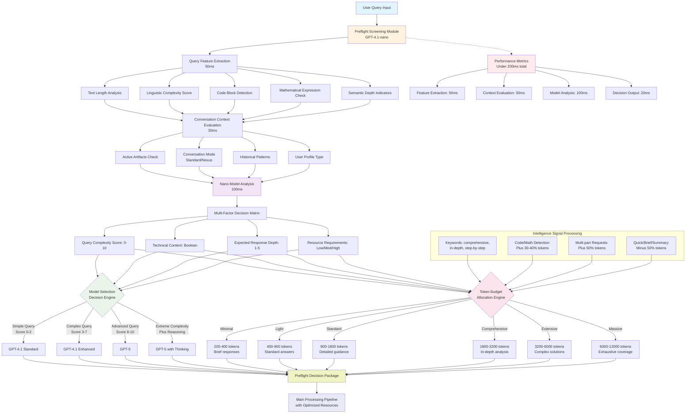
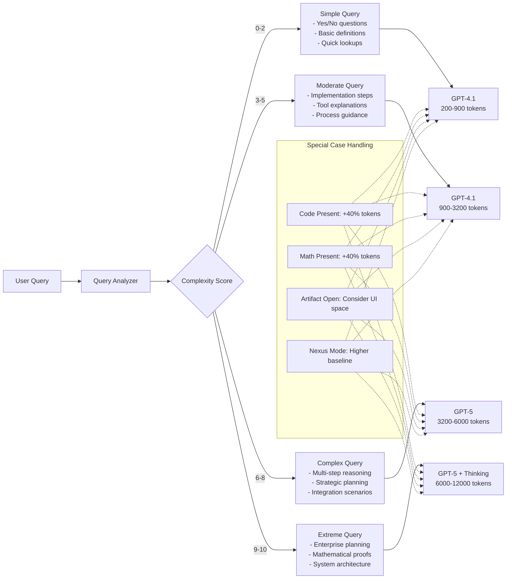
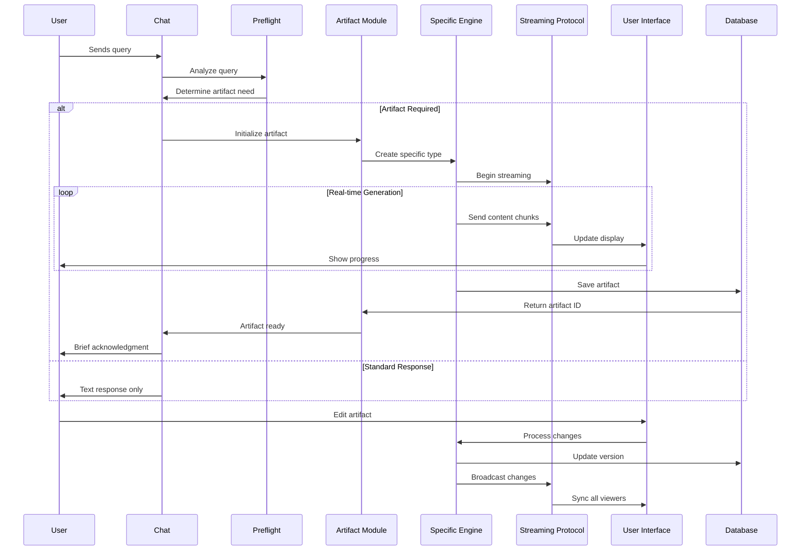
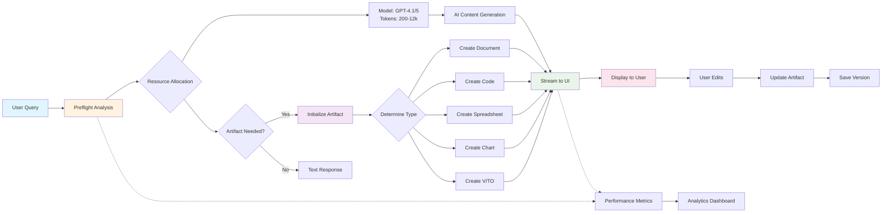
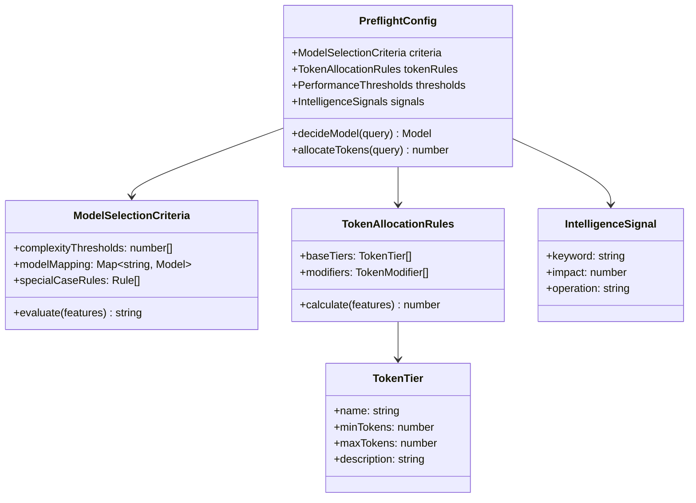
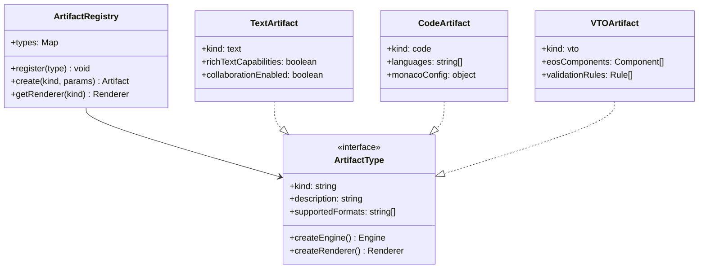

# Patent Specification Technical Diagrams
## EOS AI Bot: Preflight Screening and Artifact System Architecture

---

## FIG. 8: Preflight Screening Process Flow

### Detailed Preflight Query Analysis and Model Selection

### Preflight Decision Logic Detail

---

## FIG. 9: Artifact System Architecture

### Comprehensive Artifact Generation and Management System

```mermaid
flowchart TB
    %% Core Module
    AGM[Artifact Generation Module<br/>components/artifact.tsx] --> Coordinator[Artifact Coordinator<br/>Type Detection & Routing]
    
    %% Artifact Type Detection
    Coordinator --> TypeDetect{Artifact Type<br/>Detection Engine}
    
    TypeDetect -->|Text Request| TextEngine[Text Editor Engine<br/>artifacts/text/client.tsx]
    TypeDetect -->|Code Request| CodeEngine[Code Editor Engine<br/>artifacts/code/client.tsx]
    TypeDetect -->|Data/Table| SpreadEngine[Spreadsheet Engine<br/>artifacts/sheet/client.tsx]
    TypeDetect -->|Visualization| ChartEngine[Chart Renderer<br/>artifacts/chart/client.tsx]
    TypeDetect -->|Image Request| ImageEngine[Image Generator<br/>artifacts/image/client.tsx]
    TypeDetect -->|V/TO Request| VTOEngine[V/TO Builder<br/>artifacts/vto/client.tsx]
    
    %% Text Editor Features
    TextEngine --> TE1[Rich Text Formatting<br/>Markdown Support]
    TextEngine --> TE2[Real-time Collaboration<br/>Conflict Resolution]
    TextEngine --> TE3[Version History<br/>Change Tracking]
    
    %% Code Editor Features
    CodeEngine --> CE1[Monaco Editor Core<br/>VS Code Engine]
    CodeEngine --> CE2[Syntax Highlighting<br/>50+ Languages]
    CodeEngine --> CE3[IntelliSense<br/>Auto-completion]
    CodeEngine --> CE4[Multi-file Support<br/>Project Structure]
    
    %% Spreadsheet Features
    SpreadEngine --> SE1[Formula Engine<br/>Excel Compatible]
    SpreadEngine --> SE2[Cell Formatting<br/>Conditional Styles]
    SpreadEngine --> SE3[Data Validation<br/>Input Controls]
    SpreadEngine --> SE4[Pivot Tables<br/>Data Analysis]
    
    %% Chart Features
    ChartEngine --> CHE1[Chart.js Core<br/>Dynamic Rendering]
    ChartEngine --> CHE2[Multiple Chart Types<br/>Line/Bar/Pie/Scatter]
    ChartEngine --> CHE3[Interactive Controls<br/>Zoom/Pan/Filter]
    ChartEngine --> CHE4[Real-time Updates<br/>Live Data Binding]
    
    %% Image Features
    ImageEngine --> IE1[AI Generation<br/>DALL-E Integration]
    ImageEngine --> IE2[Style Controls<br/>Artistic Parameters]
    ImageEngine --> IE3[Resolution Options<br/>Quality Settings]
    
    %% V/TO Builder Features
    VTOEngine --> VE1[EOS Structure<br/>All 8 Components]
    VTOEngine --> VE2[Interactive Forms<br/>Guided Input]
    VTOEngine --> VE3[Validation Rules<br/>EOS Compliance]
    VTOEngine --> VE4[PDF Generation<br/>Professional Output]
    
    %% Shared Systems
    TextEngine & CodeEngine & SpreadEngine & ChartEngine & ImageEngine & VTOEngine --> SharedSystems[Shared Infrastructure]
    
    SharedSystems --> Version[Version Control System<br/>lib/artifacts/version-control.ts]
    SharedSystems --> Export[Export Module<br/>lib/artifacts/export.ts]
    SharedSystems --> Stream[Streaming Protocol<br/>lib/artifacts/streaming.ts]
    SharedSystems --> Persist[Persistence Layer<br/>lib/db/artifacts.ts]
    SharedSystems --> Collab[Collaboration Engine<br/>lib/artifacts/collaboration.ts]
    
    %% Version Control Detail
    Version --> VC1[Change Tracking<br/>Diff Generation]
    Version --> VC2[Branch Management<br/>Merge Conflicts]
    Version --> VC3[Rollback Support<br/>History Navigation]
    
    %% Export Options
    Export --> EX1[PDF Export<br/>Print-ready]
    Export --> EX2[Word/Excel<br/>Native Formats]
    Export --> EX3[JSON/CSV<br/>Data Exchange]
    Export --> EX4[Image Export<br/>PNG/JPEG/SVG]
    
    %% Streaming Detail
    Stream --> ST1[WebSocket Protocol<br/>Real-time Updates]
    Stream --> ST2[Chunk Management<br/>Progressive Rendering]
    Stream --> ST3[Error Recovery<br/>Resilient Streaming]
    
    %% Persistence Detail
    Persist --> DB[(PostgreSQL<br/>Artifact Storage)]
    Persist --> Cache[(Redis Cache<br/>Performance Layer)]
    Persist --> S3[(S3 Storage<br/>Large Files)]
    
    %% UI Integration
    SharedSystems --> UILayer[UI Integration Layer]
    UILayer --> SidePanel[Side Panel View<br/>components/artifact-panel.tsx]
    UILayer --> FullScreen[Full Screen Mode<br/>Immersive Editing]
    UILayer --> Preview[Preview Mode<br/>Read-only Display]
    
    %% Styling
    style AGM fill:#e1f5fe
    style Coordinator fill:#fff3e0
    style SharedSystems fill:#f0f4c3
    style TextEngine fill:#e8f5e8
    style CodeEngine fill:#f3e5f5
    style SpreadEngine fill:#ffebee
    style ChartEngine fill:#fce4ec
    style ImageEngine fill:#fff8e1
    style VTOEngine fill:#e8eaf6
```

### Artifact Lifecycle and Data Flow

### V/TO Builder Component Architecture

```mermaid
graph TD
    %% V/TO Structure
    VTO[V/TO Builder] --> Components[8 Core Components]
    
    Components --> CV[Core Values<br/>3-7 values]
    Components --> CF[Core Focus<br/>Purpose + Niche]
    Components --> TYT[10-Year Target<br/>BHAG]
    Components --> MS[Marketing Strategy]
    Components --> TYP[3-Year Picture]
    Components --> OYP[1-Year Plan]
    Components --> QR[Quarterly Rocks]
    Components --> IL[Issues List]
    
    %% Marketing Strategy Breakdown
    MS --> MS1[Target Market]
    MS --> MS2[3 Uniques]
    MS --> MS3[Proven Process]
    MS --> MS4[Guarantee]
    
    %% 3-Year Picture Breakdown
    TYP --> TYP1[Future Date]
    TYP --> TYP2[Revenue Target]
    TYP --> TYP3[Profit Target]
    TYP --> TYP4[Measurables]
    
    %% Interactive Features
    subgraph "Interactive Editing"
        IE1[Inline Editing]
        IE2[Drag & Drop]
        IE3[Auto-save]
        IE4[Validation]
    end
    
    CV & CF & TYT & MS & TYP & OYP & QR & IL --> IE1
    CV & CF & TYT & MS & TYP & OYP & QR & IL --> IE2
    CV & CF & TYT & MS & TYP & OYP & QR & IL --> IE3
    CV & CF & TYT & MS & TYP & OYP & QR & IL --> IE4
    
    %% Export Options
    VTO --> Export[Export Options]
    Export --> PDF[PDF Export<br/>Professional Format]
    Export --> Word[Word Export<br/>Editable Document]
    Export --> Share[Share Link<br/>Collaboration]
```

---

## Integration Between Preflight and Artifact Systems

### Combined System Flow

---

## Technical Implementation Details

### Preflight Configuration Schema

### Artifact Type Registry

---

## Summary

These diagrams illustrate the sophisticated technical architecture of the EOS AI Bot's preflight screening and artifact generation systems. The preflight system provides intelligent resource optimization with sub-200ms decision making, while the artifact system transforms conversational AI into a comprehensive document creation and collaboration platform. Together, they represent significant innovations in AI-powered business methodology implementation.
